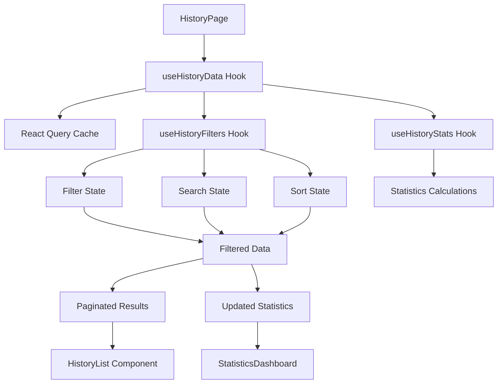

# Design Document

## Overview

The history page enhancement transforms the current basic betting history view into a comprehensive analytics dashboard. The design focuses on providing users with actionable insights through statistics, powerful filtering capabilities, and smooth performance through infinite scroll and proper debouncing. The architecture leverages existing React Query patterns, Zustand state management, and the established UI component library.

## Architecture

### Component Hierarchy

```
HistoryPage
├── StatisticsDashboard
│   ├── StatCard (x8 - for each metric)
│   └── StatCardSkeleton (loading states)
├── HistoryControls
│   ├── SearchInput (with debouncing)
│   ├── FilterPanel
│   │   ├── FilterDrawer (mobile)
│   │   ├── FilterModal (tablet)
│   │   └── FilterSidebar (desktop)
│   ├── SortSelector
│   └── ExportButton
├── ActiveFilters
│   └── FilterChip (x multiple)
├── HistoryList
│   ├── VirtualizedList (for performance)
│   ├── HistoryCard (enhanced)
│   ├── InfiniteScrollTrigger
│   └── LoadingIndicator
└── EmptyState
```

### Data Flow Architecture



## Components and Interfaces

### Core Data Types

```typescript
interface BetRecord {
  id: string;
  roundId: string;
  type: 'bull' | 'bear';
  amount: string;
  timestamp: string;
  transactionHash: string;
  status: 'won' | 'lost' | 'pending' | 'calculating';
  claimedAmount?: string;
  profit?: string;
  lockPrice?: string;
  closePrice?: string;
}

interface UserStatistics {
  totalBets: number;
  totalWagered: string;
  totalWinnings: string;
  netProfit: string;
  winRate: number;
  averageBet: string;
  longestWinStreak: number;
  longestLoseStreak: number;
  currentStreak: {
    type: 'win' | 'lose';
    count: number;
  };
}

interface FilterState {
  outcome: 'all' | 'won' | 'lost' | 'pending' | 'calculating';
  betType: 'all' | 'bull' | 'bear';
  dateRange: {
    preset: 'all' | '7d' | '30d' | '90d' | 'custom';
    startDate?: Date;
    endDate?: Date;
  };
  amountRange: {
    min?: number;
    max?: number;
  };
  search: string;
}

interface SortState {
  field: 'date' | 'amount' | 'round' | 'profit';
  direction: 'asc' | 'desc';
}

interface PaginationState {
  page: number;
  hasMore: boolean;
  isLoading: boolean;
  pageSize: number;
}
```

### Statistics Dashboard Component

```typescript
interface StatisticsDashboardProps {
  statistics: UserStatistics;
  isLoading: boolean;
  filteredData?: BetRecord[];
}

interface StatCardProps {
  title: string;
  value: string | number;
  subtitle?: string;
  trend?: {
    value: number;
    isPositive: boolean;
  };
  icon: React.ReactNode;
  color: 'green' | 'red' | 'blue' | 'purple' | 'yellow';
  isLoading?: boolean;
}
```

The statistics dashboard uses a responsive grid layout:
- Mobile: 2x4 grid (2 columns, 4 rows)
- Tablet: 4x2 grid (4 columns, 2 rows)  
- Desktop: 8x1 grid (8 columns, 1 row)

### Enhanced History Controls

```typescript
interface HistoryControlsProps {
  filters: FilterState;
  onFiltersChange: (filters: FilterState) => void;
  sort: SortState;
  onSortChange: (sort: SortState) => void;
  onExport: () => void;
  totalResults: number;
  isExporting: boolean;
}

interface SearchInputProps {
  value: string;
  onChange: (value: string) => void;
  placeholder: string;
  debounceMs: number;
}
```

### Filter Panel Architecture

The filter panel adapts to different screen sizes:

**Mobile (Drawer):**
- Full-screen drawer from bottom
- Touch-optimized controls
- Collapsible sections

**Tablet (Modal):**
- Centered modal dialog
- Two-column layout for filters
- Touch and mouse optimized

**Desktop (Inline/Sidebar):**
- Collapsible sidebar or inline panel
- Compact form layout
- Keyboard navigation support

### Virtual List Implementation

```typescript
interface VirtualizedListProps {
  items: BetRecord[];
  renderItem: (item: BetRecord, index: number) => React.ReactNode;
  itemHeight: number;
  containerHeight: number;
  overscan: number;
  onLoadMore: () => void;
  hasMore: boolean;
  isLoading: boolean;
}
```

Uses react-window for virtualization when list exceeds 100 items, providing:
- Smooth scrolling performance
- Memory efficiency
- Infinite scroll integration

## Data Models

### Enhanced Bet Processing

```typescript
interface ProcessedBetData {
  // Original bet data
  ...BetRecord;
  
  // Calculated fields
  profit: string;
  profitPercentage: number;
  isWinner: boolean;
  roundDuration?: number;
  priceMovement?: {
    lockPrice: string;
    closePrice: string;
    percentage: number;
  };
  
  // UI state
  isHighlighted: boolean;
  matchesSearch: boolean;
}
```

### Statistics Calculation Engine

```typescript
class StatisticsCalculator {
  static calculateUserStats(bets: BetRecord[]): UserStatistics {
    // Implements all statistical calculations
    // Handles edge cases and null values
    // Optimized for performance with large datasets
  }
  
  static calculateStreaks(bets: BetRecord[]): {
    longestWin: number;
    longestLose: number;
    current: { type: 'win' | 'lose'; count: number };
  } {
    // Streak calculation logic
  }
  
  static calculateProfitLoss(bets: BetRecord[]): {
    totalWagered: string;
    totalWinnings: string;
    netProfit: string;
  } {
    // Profit/loss calculations with precision handling
  }
}
```

## Error Handling

### Error Boundary Strategy

```typescript
interface HistoryErrorBoundaryState {
  hasError: boolean;
  error?: Error;
  errorInfo?: ErrorInfo;
}

class HistoryErrorBoundary extends Component<Props, HistoryErrorBoundaryState> {
  // Handles component-level errors
  // Provides fallback UI
  // Logs errors for debugging
}
```

### Network Error Handling

```typescript
interface ErrorState {
  type: 'network' | 'parsing' | 'validation' | 'unknown';
  message: string;
  retryable: boolean;
  retryCount: number;
}

const useErrorHandler = () => {
  // Centralized error handling
  // Retry logic with exponential backoff
  // User-friendly error messages
};
```

## Testing Strategy

### Unit Testing Approach

```typescript
// Statistics calculation tests
describe('StatisticsCalculator', () => {
  test('calculates win rate correctly', () => {
    // Test various scenarios
  });
  
  test('handles empty data gracefully', () => {
    // Edge case testing
  });
});

// Filter logic tests
describe('useHistoryFilters', () => {
  test('applies multiple filters correctly', () => {
    // Complex filter combinations
  });
  
  test('debounces search input', () => {
    // Timing-based tests
  });
});
```

### Integration Testing

```typescript
// Component integration tests
describe('HistoryPage Integration', () => {
  test('filters update statistics dashboard', () => {
    // End-to-end filter flow
  });
  
  test('infinite scroll loads more data', () => {
    // Scroll behavior testing
  });
});
```

### Performance Testing

```typescript
// Performance benchmarks
describe('Performance Tests', () => {
  test('renders 1000+ items without lag', () => {
    // Large dataset performance
  });
  
  test('filter operations complete within 100ms', () => {
    // Response time testing
  });
});
```

## Performance Optimizations

### Memoization Strategy

```typescript
// Expensive calculations memoized
const memoizedStats = useMemo(() => 
  StatisticsCalculator.calculateUserStats(filteredBets), 
  [filteredBets]
);

// Component memoization
const MemoizedStatCard = memo(StatCard);
const MemoizedHistoryCard = memo(HistoryCard);
```

### Debouncing Implementation

```typescript
const useDebounce = <T>(value: T, delay: number): T => {
  const [debouncedValue, setDebouncedValue] = useState<T>(value);
  
  useEffect(() => {
    const handler = setTimeout(() => {
      setDebouncedValue(value);
    }, delay);
    
    return () => clearTimeout(handler);
  }, [value, delay]);
  
  return debouncedValue;
};
```

### Virtual Scrolling Configuration

```typescript
const VIRTUAL_LIST_CONFIG = {
  itemHeight: 120, // Fixed height for consistent scrolling
  overscan: 5, // Items to render outside viewport
  threshold: 200, // Pixels from bottom to trigger load more
  pageSize: 20, // Items per page
};
```

## Responsive Design Implementation

### Breakpoint Strategy

```typescript
const BREAKPOINTS = {
  mobile: '(max-width: 768px)',
  tablet: '(min-width: 769px) and (max-width: 1024px)',
  desktop: '(min-width: 1025px)',
} as const;

const useResponsive = () => {
  // Hook for responsive behavior
  // Returns current breakpoint and utilities
};
```

### Layout Adaptations

**Mobile Layout:**
- Vertical statistics cards
- Bottom drawer filters
- Touch-optimized interactions
- Simplified card design

**Tablet Layout:**
- 2x4 statistics grid
- Modal filter interface
- Hybrid touch/mouse support
- Medium card density

**Desktop Layout:**
- Horizontal statistics dashboard
- Sidebar or inline filters
- Keyboard navigation
- High information density

## Data Export Implementation

### Export Service

```typescript
interface ExportService {
  exportToCSV(data: BetRecord[], filters: FilterState): Promise<void>;
  exportToJSON(data: BetRecord[], filters: FilterState): Promise<void>;
  generateFileName(filters: FilterState): string;
}

const useExport = () => {
  const [isExporting, setIsExporting] = useState(false);
  const [progress, setProgress] = useState(0);
  
  const exportData = async (format: 'csv' | 'json') => {
    // Export implementation with progress tracking
  };
  
  return { exportData, isExporting, progress };
};
```

### CSV Format Specification

```csv
Round,Type,Amount,Date,Status,Profit/Loss,Transaction Hash
12345,Bull,100.00,2024-01-15 14:30:00,Won,150.00,0x123...
12346,Bear,50.00,2024-01-15 15:00:00,Lost,-50.00,0x456...
```

## Security Considerations

### Data Sanitization

```typescript
const sanitizeSearchInput = (input: string): string => {
  // Remove potentially harmful characters
  // Limit input length
  // Escape special characters
};

const validateFilterInputs = (filters: FilterState): FilterState => {
  // Validate numeric ranges
  // Sanitize date inputs
  // Ensure valid enum values
};
```

### Privacy Protection

- No sensitive data in URLs
- Local storage encryption for preferences
- Secure export file handling
- Transaction hash truncation in UI

## Accessibility Features

### Keyboard Navigation

```typescript
const useKeyboardNavigation = () => {
  // Arrow key navigation for cards
  // Tab order management
  // Escape key handling for modals
  // Enter/Space for actions
};
```

### Screen Reader Support

- Proper ARIA labels and roles
- Live regions for dynamic updates
- Descriptive alt text for icons
- Semantic HTML structure

### Color and Contrast

- WCAG AA compliance
- High contrast mode support
- Color-blind friendly palette
- Focus indicators

## Migration Strategy

### Backward Compatibility

The enhanced history page maintains compatibility with existing:
- GraphQL queries and data structures
- React Query cache keys
- URL parameters and routing
- Local storage preferences

### Gradual Rollout Plan

1. **Phase 1:** Statistics dashboard (non-breaking)
2. **Phase 2:** Enhanced filtering (additive)
3. **Phase 3:** Infinite scroll (performance improvement)
4. **Phase 4:** Export functionality (new feature)

### Feature Flags

```typescript
interface HistoryFeatureFlags {
  enableStatsDashboard: boolean;
  enableAdvancedFilters: boolean;
  enableInfiniteScroll: boolean;
  enableDataExport: boolean;
  enableVirtualization: boolean;
}
```

This design provides a comprehensive foundation for implementing the enhanced history page while maintaining performance, accessibility, and user experience standards.