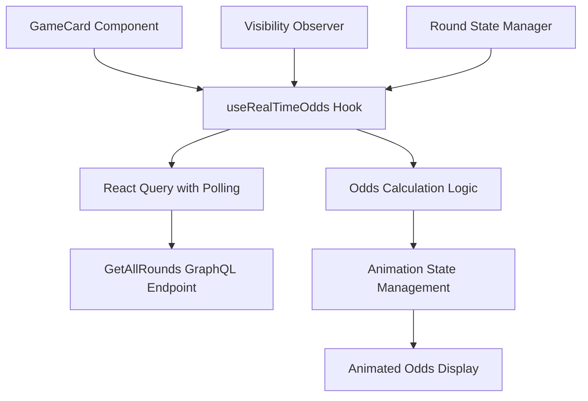

# Design Document

## Overview

This design implements real-time bet odds calculation for upcoming game cards using the GetAllRounds GraphQL endpoint with 15-second polling intervals and smooth animations. The solution enhances the existing GameCard component while maintaining performance and user experience standards.

## Architecture

### High-Level Architecture



### Data Flow

1. **GameCard Component** determines if real-time odds are needed (upcoming rounds only)
2. **useRealTimeOdds Hook** manages polling lifecycle and odds calculation
3. **React Query** handles 15-second polling with caching and error handling
4. **Odds Calculation Logic** processes round data to compute bull/bear odds
5. **Animation State Management** tracks value changes and triggers animations
6. **Animated Odds Display** renders smooth transitions between odds values

## Components and Interfaces

### Core Hook Interface

```typescript
interface UseRealTimeOddsOptions {
  roundId: string;
  enabled: boolean; // Only for upcoming rounds
  onOddsChange?: (newOdds: OddsData, previousOdds: OddsData) => void;
}

interface OddsData {
  bullOdds: number;
  bearOdds: number;
  totalPool: number;
  lastUpdated: number;
}

interface UseRealTimeOddsReturn {
  odds: OddsData;
  isLoading: boolean;
  error: Error | null;
  isAnimating: boolean;
}
```

### Animation Component Interface

```typescript
interface AnimatedOddsProps {
  value: number;
  isAnimating: boolean;
  direction: 'up' | 'down' | 'none';
  className?: string;
}
```

### Enhanced GameCard Props

The existing GameCard component will be enhanced to support real-time odds without breaking changes:

```typescript
interface GameCardProps {
  roundId: number;
  state: "live" | "ended" | "upcoming";
  active?: boolean;
  // New optional props for real-time odds
  enableRealTimeOdds?: boolean; // Default: true for upcoming rounds
}
```

## Data Models

### Odds Calculation Model

```typescript
interface RoundOddsData {
  roundId: string;
  bearAmount: string;
  bullAmount: string;
  totalPool: string;
  lastUpdated: string;
}

interface CalculatedOdds {
  bullOdds: number;
  bearOdds: number;
  totalPool: number;
  confidence: 'high' | 'medium' | 'low'; // Based on pool size
}
```

### Animation State Model

```typescript
interface AnimationState {
  isAnimating: boolean;
  direction: 'increase' | 'decrease' | 'none';
  previousValue: number;
  currentValue: number;
  animationId: string;
}
```

## Error Handling

### Network Error Handling

1. **Connection Failures**: Graceful degradation to last known odds with visual indicator
2. **Timeout Errors**: Retry mechanism with exponential backoff
3. **Invalid Data**: Fallback to static odds calculation from existing round data
4. **Rate Limiting**: Automatic interval adjustment to respect API limits

### Error Recovery Strategies

```typescript
interface ErrorRecoveryConfig {
  maxRetries: number; // 3
  retryDelay: number; // 5000ms
  fallbackToStatic: boolean; // true
  showErrorIndicator: boolean; // true
}
```

## Testing Strategy

### Unit Testing

1. **Odds Calculation Logic**: Test various pool scenarios including edge cases
2. **Animation State Management**: Verify smooth transitions and state consistency
3. **Hook Lifecycle**: Test mounting, unmounting, and state changes
4. **Error Handling**: Simulate network failures and data corruption

### Integration Testing

1. **GameCard Integration**: Verify real-time odds work with existing card states
2. **Performance Testing**: Measure impact on render performance with multiple cards
3. **Memory Leak Testing**: Ensure proper cleanup of intervals and subscriptions
4. **Visual Regression Testing**: Verify animations don't break existing UI

### Performance Testing

1. **Polling Efficiency**: Measure API call frequency and data transfer
2. **Animation Performance**: Ensure 60fps during transitions
3. **Memory Usage**: Monitor for memory leaks during extended usage
4. **Bundle Size Impact**: Measure increase in JavaScript bundle size

## Implementation Details

### Real-Time Polling Strategy

```typescript
const useRealTimeOdds = (options: UseRealTimeOddsOptions) => {
  return useQuery({
    queryKey: ['realTimeOdds', options.roundId],
    queryFn: () => predictionApi.getAllRounds(),
    select: (data) => calculateOddsForRound(data, options.roundId),
    refetchInterval: options.enabled ? 15000 : false,
    refetchIntervalInBackground: false,
    staleTime: 10000, // Consider data stale after 10 seconds
    enabled: options.enabled,
  });
};
```

### Odds Calculation Algorithm

```typescript
const calculateOdds = (bearAmount: string, bullAmount: string): CalculatedOdds => {
  const bear = parseFloat(bearAmount || '0') / 1e18;
  const bull = parseFloat(bullAmount || '0') / 1e18;
  const total = bear + bull;
  
  if (total === 0) {
    return { bullOdds: 1.0, bearOdds: 1.0, totalPool: 0, confidence: 'low' };
  }
  
  const bullOdds = bull === 0 ? 1.0 : total / bull;
  const bearOdds = bear === 0 ? 1.0 : total / bear;
  
  const confidence = total > 100 ? 'high' : total > 10 ? 'medium' : 'low';
  
  return { bullOdds, bearOdds, totalPool: total, confidence };
};
```

### Animation Implementation

```typescript
const AnimatedOdds: React.FC<AnimatedOddsProps> = ({ 
  value, 
  isAnimating, 
  direction,
  className 
}) => {
  const [displayValue, setDisplayValue] = useState(value);
  
  useEffect(() => {
    if (isAnimating) {
      // Animate from current display value to new value
      const animation = animate(displayValue, value, {
        duration: 0.5,
        ease: "easeOut",
        onUpdate: (latest) => setDisplayValue(latest),
      });
      
      return () => animation.stop();
    } else {
      setDisplayValue(value);
    }
  }, [value, isAnimating]);
  
  return (
    <motion.span
      className={cn(className, {
        'text-green-400': direction === 'increase' && isAnimating,
        'text-blue-400': direction === 'decrease' && isAnimating,
      })}
      animate={{
        scale: isAnimating ? [1, 1.05, 1] : 1,
      }}
      transition={{ duration: 0.3 }}
    >
      {displayValue.toFixed(2)}x
    </motion.span>
  );
};
```

### Performance Optimizations

1. **Intersection Observer**: Only poll for visible cards
2. **Shared Query Cache**: Multiple cards share the same GetAllRounds query
3. **Debounced Updates**: Prevent excessive re-renders during rapid changes
4. **Conditional Polling**: Stop polling when round transitions to live/ended

### Visibility Management

```typescript
const useVisibilityOptimizedPolling = (enabled: boolean) => {
  const [isVisible, setIsVisible] = useState(true);
  const elementRef = useRef<HTMLDivElement>(null);
  
  useEffect(() => {
    if (!elementRef.current) return;
    
    const observer = new IntersectionObserver(
      ([entry]) => setIsVisible(entry.isIntersecting),
      { threshold: 0.1 }
    );
    
    observer.observe(elementRef.current);
    return () => observer.disconnect();
  }, []);
  
  return { isVisible: enabled && isVisible, elementRef };
};
```

## Security Considerations

1. **API Rate Limiting**: Respect GraphQL endpoint rate limits
2. **Data Validation**: Validate all incoming round data before processing
3. **Error Information**: Avoid exposing sensitive error details to users
4. **Resource Management**: Prevent memory leaks and excessive resource usage

## Accessibility Considerations

1. **Screen Reader Support**: Announce odds changes to screen readers
2. **Reduced Motion**: Respect user's motion preferences
3. **Color Independence**: Don't rely solely on color for change indication
4. **Keyboard Navigation**: Maintain existing keyboard accessibility

## Browser Compatibility

- **Modern Browsers**: Chrome 90+, Firefox 88+, Safari 14+, Edge 90+
- **Animation Support**: Graceful degradation for browsers without motion support
- **Intersection Observer**: Polyfill for older browsers if needed
- **ES2020 Features**: Ensure compatibility with target browser support